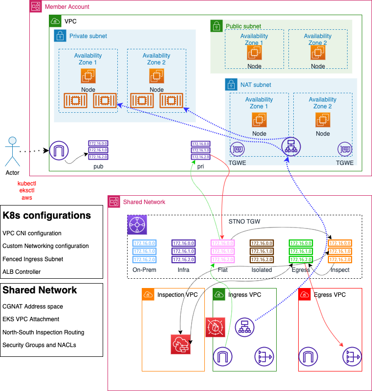

# CDK TypeScript project - Member EKS Workload behind SharedNetwork Infrastructure

This project demonstrates setup of Member EKS Workload behind SharedNetwork

Main Design points are:
- Member EKS Cluster is AWS-managed setup in Public,Private Networking model
- CDK project creates EKS Cluster with 1 Worker NodeGroup
- Work NodeGroup comprises of 2 EC2 Nodes in 2 Availability Zones
- CDK project associates 1 Additional CIDR (referred as CGNATCidr)
- CDK project creates subnets, NAT gateways, route tables and routes for CGNATCidr

## Architecture Overview
- Given below is the architecture overview diagram depicting SharedNetwork and Member AWS Accounts with Network Resources


### Cluster Configurations
- Cluster VPC has 1 default EKS VPC CIDR
  - Cluster VPC has 1 additional VPC CIDR and corresponding subnets (referred as NAT subnet)
- NodeGroup 1 is in default VPC Subnets
- NodeGroup 2 is in additional VPC Subnets
- VPC CNI, Custom Networking is configured
- AWS ALB Controller is configured
- Kubeproxy is configured
- CoreDNS is configured

### EKS Workload Configurations
- Workload Ingress is configured on NodeGroup 2
  - Ingress targeted using Annotations

### SharedNetwork Configurations
- STNO-guided North-South with Inspection Routing for Member VPC
  - TGW routing configurations
  - SharedNetwork `ingress vpc` routing configurations
- Internal ALB is generated by Ingress
- External ALB is created manually in SharedNetwork on `ingress vpc` public subnets
  - Target Group is IP addresses
  - Points to Member ALB Network Interfaces

The `cdk.json` file tells the CDK Toolkit how to execute your app.

## Deployment
- Environment should have:
  - python 3.8
  - boto3
  - node, npm (latest)
  - cdk (latest)
  - AWS IAM user credentials
    - `aws configure`
    - Suggested IAM user permissions = `AWSAdministratorAccess`
- Clone this project
- No additional Parameters
```
cdk deploy
```

## Manual configurations
Follow these steps in given sequence

### EKS configurations
- Configure VPC CNI, Custom Networking
- Configure Kubeproxy, CoreDNS
- Configure AWS ALB Controller

### Member VPC Attachment
- Tag CGNAT public and private subnets in Member EKS VPC
  - Tag Key: `Attach-to-tgw`
  - Tag Value: <No Value>
- Tag Member EKS VPC
  - Tag Key: `Propagate-to`
  - Tag Value: `Flat`
- Approve on STNO Console
  - https://d3w2kx4elxkk0b.cloudfront.net
  - User Id: adminuser
  - Password: Get from Systems Manager Parameter Store Parameter = `/stno/adminuser/password`

### SharedNetwork Configurations
- TGW Route Table = `Inspection-RTB`
  - Associate = EKS VPC
- TGW Route Table = `Egress-RTB`
  - Static Route = EKS VPC CIDR
- Configure routing in Ingress VPC = `inspect-vpc01`
  - Route Table = `vpc01-pubsubnet1-rtb`
    - Route = EKS VPC CIDR
    - Target = EKS VPC Attachment
  - Route Table = `vpc01-pubsubnet2-rtb`
    - Route = EKS VPC CIDR
    - Target = EKS VPC Attachment
  - Route Table = `vpc01-pubsubnet2-rtb`
    - Route = EKS VPC CIDR
    - Target = EKS VPC Attachment
  - Route Table = `vpc01-tgw1-rtb`
    - Route = EKS VPC CIDR
    - Target = EKS VPC Attachment
  - Route Table = `vpc01-tgw2-rtb`
    - Route = EKS VPC CIDR
    - Target = EKS VPC Attachment
- Configure routing in Egress VPC = `egress-vpc01`
  - Route Table = `egress-vpc01-pub`
    - Route = EKS VPC CIDR
    - Target = EKS VPC Attachment
  - Route Table = `egress-vpc01-tgw1`
    - Route = EKS VPC CIDR
    - Target = EKS VPC Attachment
  - Route Table = `egress-vpc01-tgw2`
    - Route = EKS VPC CIDR
    - Target = EKS VPC Attachment

### Member VPC Configurations
- Change public subnet 1
  - Route = 0.0.0.0/0
  - From: IGW
  - To: TGW
- Change public subnet 2
  - Route = 0.0.0.0/0
  - From: IGW
  - To: TGW
- Change NAT private subnet 1
  - Route = 0.0.0.0/0
  - From: NGW
  - To: TGW
- Change NAT private subnet 2
  - Route = 0.0.0.0/0
  - From: NGW
  - To: TGW
- Change cluster default Security Group
  - Allow: All Traffic
  - From: 11.0.0.0/16 (`ingress vpc`)
- Change NAT Security Group
  - Allow: All Traffic
  - From: 11.0.0.0/16 (`ingress vpc`)

### Deploy Workload
- Configure Ingress Annotations = `alb.ingress.kubernetes.io/subnets`
  - CGNAT Private Subnets (comma-separated)

### Verify Workload Ingress
- Ingress should show Internal ALB Private DNS
- Inspect Network Interfaces for Internal ALB
  - Note down 2 IP Addresses (2 Availability Zones)

### External ALB in SharedNetwork
- Create TargetGroup for IP Addresses
  - Configure 2 Internal ALB Addresses from Member Account
- Create External ALB

### Test Member EKS Workload
- Access the HTTP URL of Member EKS Workload on browser

## Useful commands

* `cdk deploy`      deploy resources
* `cdk destroy`     destroy launched resources
* `npm install`     installs all dependencies
* `npm run build`   compile typescript to js
* `npm run watch`   watch for changes and compile
* `npm run test`    perform the jest unit tests
* `cdk deploy`      deploy this stack to your default AWS account/region
* `cdk diff`        compare deployed stack with current state
* `cdk synth`       emits the synthesized CloudFormation template
